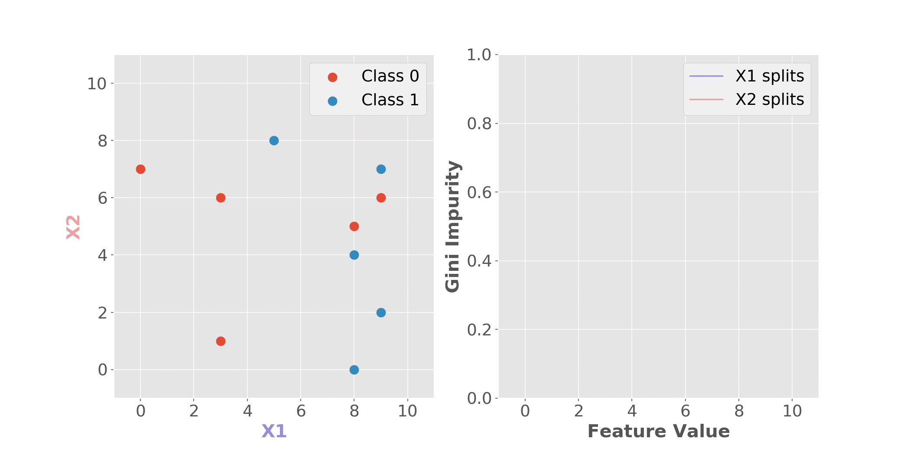
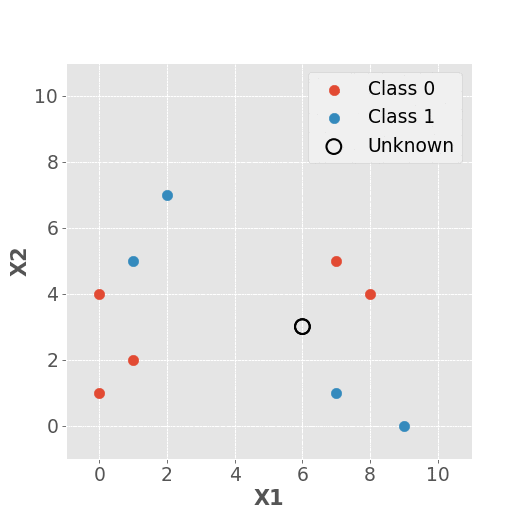

# Machine Learning Animations

I find visuals, particularly animations, especially useful for understanding how machine learning algorithms work. This repository houses animations that I've developed for teaching purposes.

## Decision Tree

The animation below shows a decision tree being created. For every potential split in the raw data (shown on the left panel), the [Gini impurity](https://en.wikipedia.org/wiki/Decision_tree_learning#Gini_impurity) is calculated (right panel). The split resulting in the minimum impurity is selected as the split for the tree, and the process is repeated until all data points have been split into homogenous groups.

## *k*-Nearest Neighors

The animation below shows the prediction of an unknown point using increasing values of *k* in the *k*-nearest neighbors algorithm. The animation only shows odd values for *k*. In a two-class problem such as that shown, even values of *k* may result in ties, such that a decision would have to be made on how to predict the query point, for example, a random class may be predicted, or the class of the closest point may be predicted.

## Convolutional Neural Network

### 1D ConvNet

The animation below shows how a 1D sequence (d=1) of 20 observations (T=20) is "broken into" 4 sequences by a 1D convolutional layer with 4 filters (f=4) of length 3. The original input is 2D with shape (d=1, T=20), the output of the 1D convolutional layer is 3D with shape (d=1, f=4, T=20).

